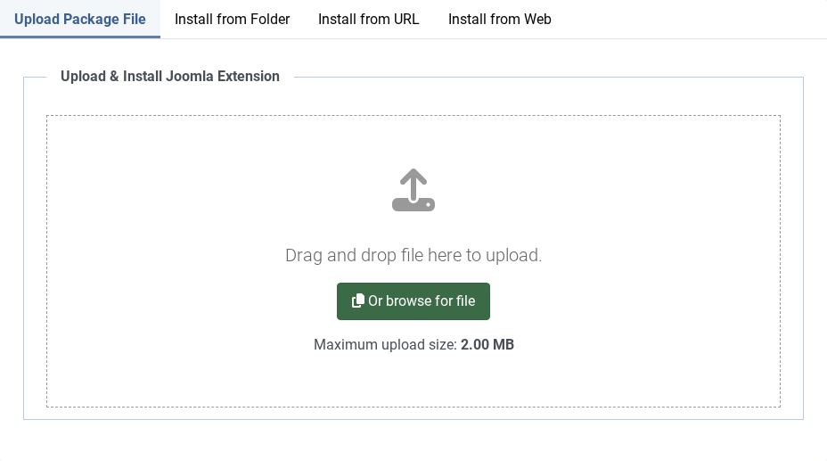
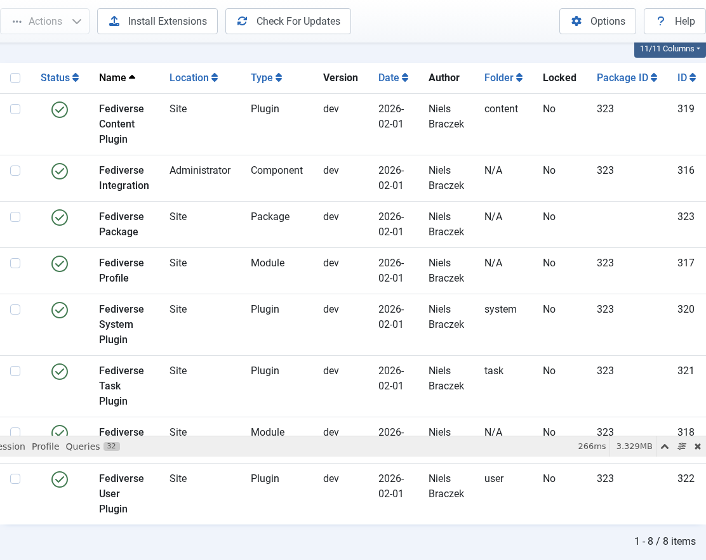
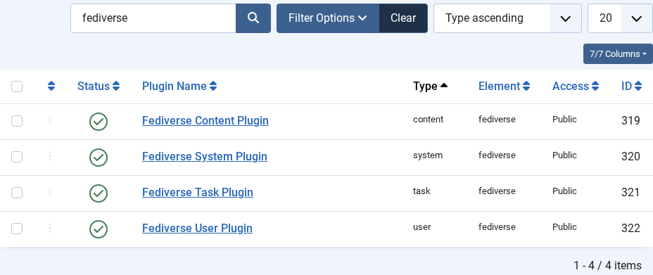
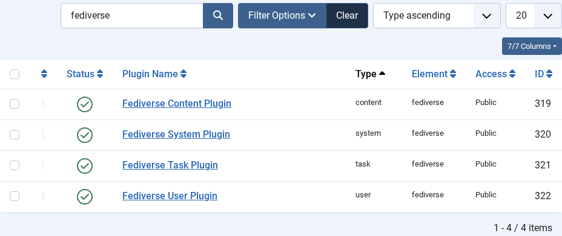
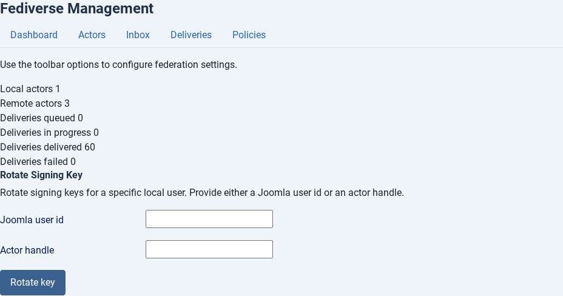

# Installing Joomla Fediverse

---
[🏠 Tutorial Home](index.md) | [Configuration →](02-configuration.md)

This guide walks you through downloading, installing, and verifying **Joomla Fediverse** — the Joomla ActivityPub extension that turns your Joomla 6 site into a Fediverse citizen.

## Prerequisites

- Joomla 6.x or later
- PHP 8.2 or later
- A publicly accessible URL (ActivityPub requires HTTPS in production; HTTP is acceptable for local testing)

## Step 1: Download the Package

The distribution archive is a single ZIP file named `pkg_fediverse.zip`. It bundles all sub-extensions — the component, four plugins, and the module — so a single install step is all you need.

Download the latest release from the project repository's Releases page and save `pkg_fediverse.zip` to a location you can browse to from your browser. Do **not** unzip it; Joomla's Extension Manager expects the archive as-is.

## Step 2: Install via Extension Manager

1. Log in to your Joomla administrator back-end.
2. Open **System** in the top navigation bar, then choose **Extensions → Install** from the System panel.
3. On the Install page, select the **Upload Package File** tab.
4. Click **Browse for file** (or drag the ZIP onto the drop zone) and select `pkg_fediverse.zip`.

*The Extension Manager upload form. Navigate to System → Extensions → Install.*

5. Click **Upload & Install**. Joomla will unpack and register every sub-extension in one pass.

After a successful install the page reloads and displays a green confirmation bar. The message lists each installed item: the component `com_fediverse`, four plugins (`plg_system_fediverse`, `plg_content_fediverse`, `plg_task_fediverse`, `plg_user_fediverse`), and the module `mod_fediverse_reactions`.

*Successful installation shows a green confirmation message listing all installed sub-extensions.*

## Step 3: Enable Required Plugins

Installation registers the plugins but leaves them disabled so you can review your site before switching anything on. Four plugins are installed; two are required for basic federation and two are optional features:

1. **System - Fediverse** (`plg_system_fediverse`) — **Required.** Handles HTTP Signature verification and request routing for all ActivityPub endpoints.
2. **Content - Fediverse** (`plg_content_fediverse`) — **Required.** Hooks into article save and publish events to queue outbound activities.
3. **Task - Fediverse** (`plg_task_fediverse`) — *Optional.* Registers the background delivery and cleanup tasks with Joomla's Scheduler. Enable when you are ready to configure scheduled tasks (see [Tutorial 09](09-tasks.md)).
4. **User - Fediverse** (`plg_user_fediverse`) — *Optional.* Handles per-user federation opt-out preferences. Enable when you need that feature (see [Tutorial 07](07-policies.md)).

To enable the required plugins:

1. Navigate to **System → Plugins** in the administrator menu.
2. In the search bar at the top of the Plugins list, type `fediverse` and press Enter. The list narrows to the four Joomla Fediverse plugins.

*Filter the Plugins list by "fediverse" to find both plugins.*

3. Click the status toggle (or the red circle icon) next to **System - Fediverse** to enable it. The icon turns green.
4. Repeat for **Content - Fediverse**.
5. Confirm that both required plugins now show a green checkmark in the **Status** column.

*Both required plugins should show a green checkmark in the Status column.*

> **Note:** Enable **Task - Fediverse** and **User - Fediverse** only when you need those features. They are not required for basic federation.

## Step 4: Verify Installation

With both required plugins enabled, open **Components → Fediverse** from the administrator menu. You should land on the Fediverse Dashboard, which confirms the extension is wired up and active.

On a fresh install every counter on the dashboard will read zero — there are no local actors yet and the delivery queue is empty. That is expected; you will populate actors in the next tutorial step.

*The Fediverse Dashboard confirms the extension is active. Actor and delivery counts will be zero on a fresh install.*

## Common Issues

| Symptom | Likely cause | Solution |
|---------|--------------|----------|
| Package install fails with "Could not find install package" | ZIP file is corrupted or incomplete | Re-download the package and retry |
| Plugins not visible after install | Extension cache not cleared | Go to System → Clear Cache and try again |
| Dashboard shows error after enabling plugins | Another plugin conflict | Temporarily disable other system plugins and re-test |
| HTTPS warning in logs | Site not served over HTTPS | In development, HTTP is fine; in production configure SSL |
---
[🏠 Tutorial Home](index.md) | [Configuration →](02-configuration.md)
