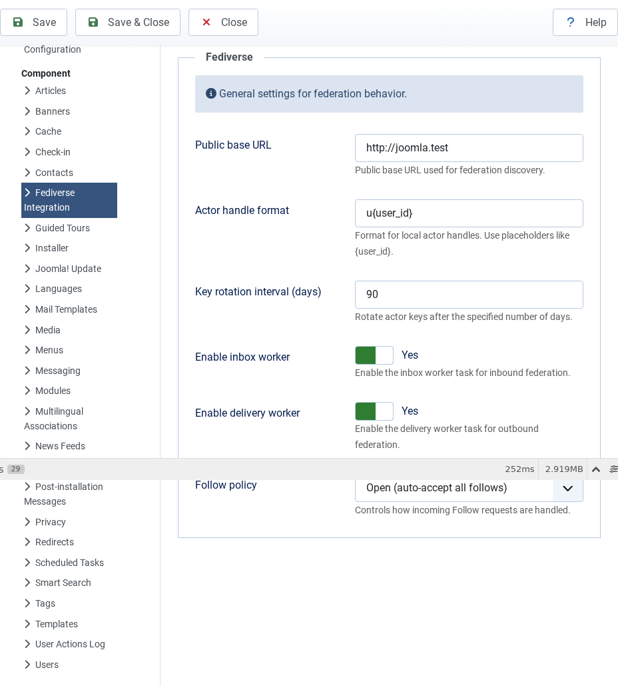
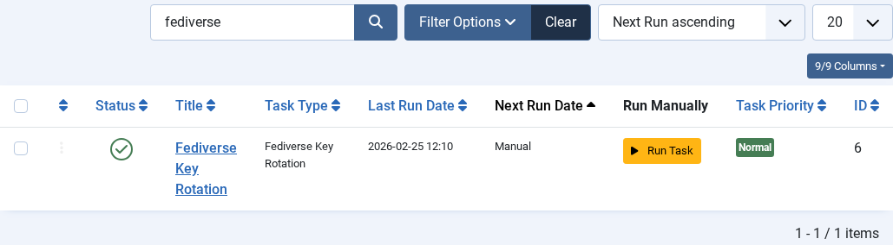
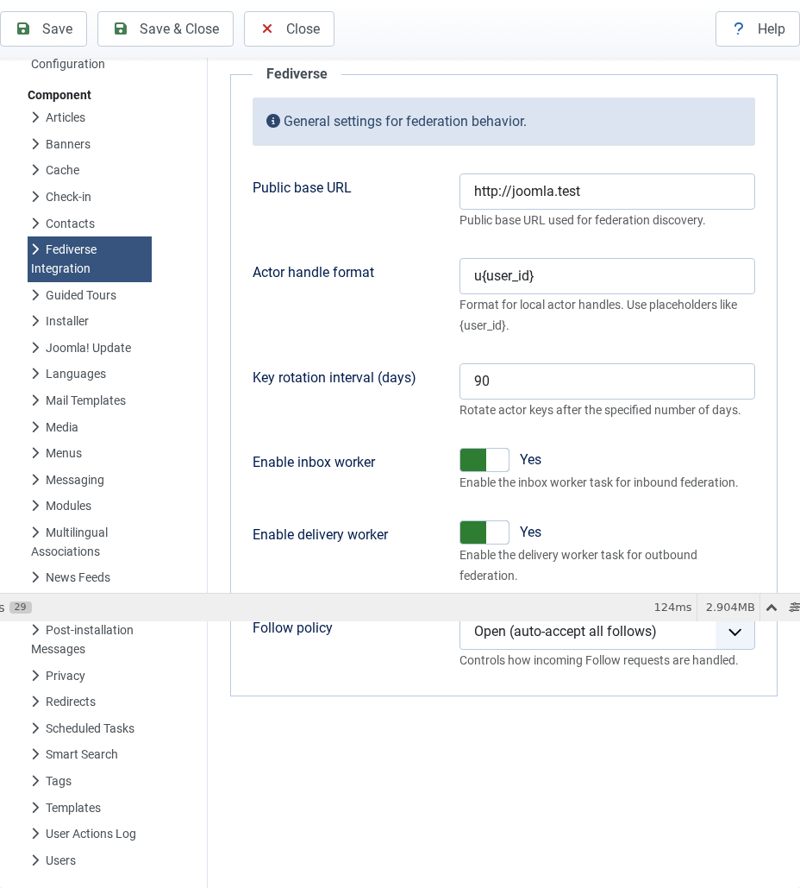

# Configuring Joomla Fediverse

---
[🏠 Tutorial Home](index.md) | [← Installing Joomla Fediverse](01-installation.md) | [Creating Actors →](03-actors.md)


Before you can create actors or publish content to the Fediverse, you need to tell Joomla Fediverse a few things about your site: its public identity, how aggressively to allow incoming follows, and which background tasks should run. This tutorial walks through every setting you are likely to touch on a typical installation.

## Prerequisites

- Joomla Fediverse installed and both required plugins enabled (see [Tutorial 01 — Installation](01-installation.md))
- Administrator access to the Joomla back-end

---

## Step 1: Global Settings

Open **Components → Fediverse** from the administrator menu, then click the **Options** button in the toolbar (top-right). You land on the Fediverse configuration form.


*The Fediverse configuration form. Reach it via Components → Fediverse → Options.*

The fields you should review immediately:

| Field | What it does | Recommended value |
|---|---|---|
| **Site handle suffix** | The domain appended to actor handles — `grace@yoursite.example`. Must match your site's public domain. | `yoursite.example` |
| **Base URL** | The HTTPS root URL of your Joomla site. ActivityPub uses this to build all actor and object URIs. | `https://yoursite.example` |
| **Maximum incoming follows** | Hard cap on the total number of remote followers any single local actor can accumulate. Set to `0` to disable the cap. | `0` (unlimited) or a sane integer |
| **Default follow policy** | `auto-accept` approves all incoming follow requests immediately; `manual` queues them for review. | `auto-accept` for a public site |

After editing, click **Save** in the toolbar to apply the changes, or **Save & Close** to return to the dashboard.

> **Tip:** The Base URL must match the domain your Joomla installation is served on. Mismatches cause WebFinger lookups and HTTP-Signature verification to fail silently.

---

## Step 2: Scheduler Tasks

Joomla Fediverse relies on two scheduled tasks to move activities through the delivery pipeline and clean up stale data. These tasks must exist in Joomla's Task Scheduler and must be triggered by a cron job (or by Joomla's lazy-execution mode).

Navigate to **System → Scheduled Tasks** in the administrator menu. Use the search bar to filter by `fediverse`.


*Two Fediverse tasks should appear: the delivery task and the cleanup task.*

You should see two entries:

- **Fediverse — Deliver Outbound Activities** — dequeues items from the delivery queue and sends them to remote inboxes via HTTP POST. Should run every one to five minutes.
- **Fediverse — Inbox Cleanup** — purges processed inbox entries older than a configurable retention window. Can run daily.

If either task is missing, click **New** and add it from the Fediverse task type. If the tasks exist but show a red status icon, click the task name and ensure **Published** is set to *Yes*.

### Cron configuration

For reliable delivery, call Joomla's scheduler endpoint from a server-side cron job:

```sh
*/5 * * * * curl -s "https://yoursite.example/index.php?option=com_ajax&plugin=fediverse&format=json" > /dev/null 2>&1
```

Alternatively, enable Joomla's built-in **Web Cron** under **System → Global Configuration → Server** so that normal page loads trigger pending tasks (convenient for development; not recommended for production).

---

## Step 3: Verifying the WebFinger Endpoint

WebFinger is the discovery protocol other Fediverse servers use to find your actors. Before creating any actors, confirm the endpoint is reachable.

Open a browser (or use `curl`) and visit:

```
/.well-known/webfinger?resource=acct:grace@yoursite.example
```

Replace `grace` with any local actor handle you have already created, and replace `yoursite.example` with your site's domain.

A healthy response looks like this:

```json
{
  "subject": "acct:grace@yoursite.example",
  "aliases": ["https://yoursite.example/activitypub/actors/grace"],
  "links": [
    {
      "rel": "self",
      "type": "application/activity+json",
      "href": "https://yoursite.example/activitypub/actors/grace"
    }
  ]
}
```


*A valid WebFinger response confirms the System plugin is active and routing correctly.*

If the endpoint returns a 404, the **System - Fediverse** plugin is either disabled or its routing rules are blocked by another plugin. If it returns HTML instead of JSON, the `Accept` header is not being respected — check that no caching layer is stripping request headers.

---

## Common Issues

| Symptom | Likely cause | Solution |
|---|---|---|
| Configuration form shows "Save failed" | File-system permissions on the `configuration.php` directory | Give the web server write access to the Joomla root, or use a custom params table |
| Scheduler tasks never fire | System cron not configured | Add a cron entry as shown above, or enable Web Cron |
| WebFinger returns 404 | System - Fediverse plugin disabled | Enable `plg_system_fediverse` in **System → Plugins** |
| WebFinger returns HTML | Caching plugin serving a cached HTML response | Exclude `/.well-known/*` from caching rules |
| Remote server can't resolve actors | Base URL does not match actual domain | Re-check the **Base URL** field in Options |
---
[🏠 Tutorial Home](index.md) | [← Installing Joomla Fediverse](01-installation.md) | [Creating Actors →](03-actors.md)
