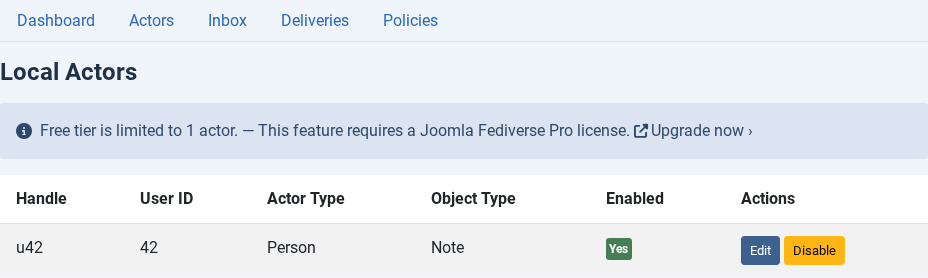
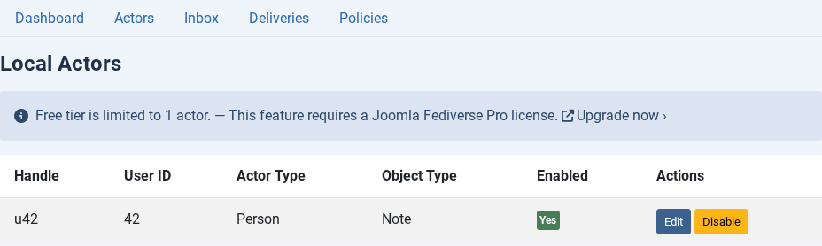
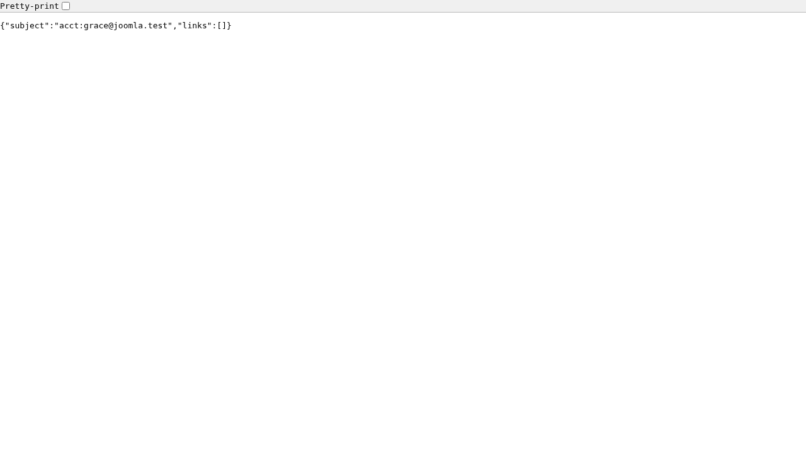

# Creating Actors

---
[🏠 Tutorial Home](index.md) | [← Configuration](02-configuration.md) | [Publishing Content →](04-publishing.md)


## What Is an Actor?

In ActivityPub, an **actor** is the identity that sends and receives activities. Think of it as the Fediverse equivalent of a social media account: it has a unique handle (like `grace@yoursite.example`), a public key used to sign outgoing HTTP requests, an inbox where remote servers deposit activities addressed to it, and an outbox that exposes its published content to the world. On a Joomla site every local Fediverse participant — an author, an editor, a site bot — is represented by exactly one actor.

---

## Prerequisites

- Joomla Fediverse installed, both plugins enabled, and the **Base URL** / **handle suffix** set in Options (see [Tutorial 02 — Configuration](02-configuration.md))
- A Joomla user account that the actor will be associated with

---

## Step 1: Open the Actors View

In the Joomla administrator, navigate to **Components → Fediverse → Actors**. On a brand-new installation the list will be empty.


*The Actors list on a fresh installation. No actors exist yet.*

---

## Step 2: Create a New Actor

Click **New** in the toolbar. The actor creation form opens.


*Fill in the Handle field and associate the actor with a Joomla user.*

Fill in the following fields:

| Field | Value | Notes |
|---|---|---|
| **Handle** | `grace` | Lowercase, no spaces. This becomes `grace@yoursite.example`. |
| **Joomla User** | Grace (grace@yoursite.example) | Select the Joomla user account for this actor. |
| **Status** | Published | Unpublished actors are invisible to remote servers. |
| **Actor Type** | `Person` | Leave as `Person` for regular author accounts. Set to `Service` for automated/bot actors. |
| **Object Type** | `Note` | The ActivityPub type for federated articles. `Note` is universally supported. Use `Article` for AP clients that render full articles; `Image` or `Video` for media-centric feeds. |

Leave all other fields at their defaults unless you have a specific reason to change them. Click **Save & Close**.

> **Tip:** The handle is permanent. Once a remote server has resolved `grace@yoursite.example` and cached the actor document, renaming the actor will break those cached references. Choose a handle you are happy to keep.

---

## Step 3: Confirm the Actor Appears in the List

Back on the Actors list you should now see a row for grace with a green status indicator.


*The Actors list now shows grace's actor with a Published status.*

---

## Step 4: Verify via WebFinger

Any Fediverse server that wants to talk to grace will first perform a WebFinger lookup. Test it yourself by visiting this URL in your browser (substitute your own domain):

```
https://yoursite.example/.well-known/webfinger?resource=acct:grace@yoursite.example
```

You should receive a JSON response similar to:

```json
{
  "subject": "acct:grace@yoursite.example",
  "links": [
    {
      "rel": "self",
      "type": "application/activity+json",
      "href": "https://yoursite.example/activitypub/actors/grace"
    }
  ]
}
```


*A successful WebFinger response for `grace@yoursite.example`. The `href` in the `self` link is the actor URI.*

---

## Step 5: Verify the Actor Document

Follow the `href` from the WebFinger response (or navigate directly to `/activitypub/actors/grace`) with an `Accept: application/activity+json` header. The response is the full ActivityPub actor document:

```json
{
  "@context": "https://www.w3.org/ns/activitystreams",
  "id": "https://yoursite.example/activitypub/actors/grace",
  "type": "Person",
  "preferredUsername": "grace",
  "inbox": "https://yoursite.example/activitypub/actors/grace/inbox",
  "outbox": "https://yoursite.example/activitypub/actors/grace/outbox",
  "publicKey": {
    "id": "https://yoursite.example/activitypub/actors/grace#main-key",
    "owner": "https://yoursite.example/activitypub/actors/grace",
    "publicKeyPem": "-----BEGIN PUBLIC KEY-----\n..."
  }
}
```

The presence of `inbox`, `outbox`, and `publicKey.publicKeyPem` confirms the actor is fully operational. Remote servers use the public key to verify that activities signed by grace actually came from your server.

> **Tip:** If you configured the actor with **Actor Type = Service**, the document will show `"type": "Service"` instead. This signals to Fediverse servers that the account is automated.

---

## Actor Type and Object Type

After creating an actor you can change its **Actor Type** and **Object Type** at any time via **Edit → Actor Type** and **Edit → Object Type** dropdowns on the actor edit form.

### Actor Type: Person vs Service

| Type | When to use |
|------|-------------|
| **Person** | Regular author accounts — a human contributor whose articles are federated. This is the default and the most widely supported type. |
| **Service** | Automated or bot accounts — a feed bot, a news account, or any actor that posts without direct human involvement. Mastodon, GotoSocial, and other clients display a bot badge next to Service actors. |

The chosen type appears in the ActivityPub actor document as `"type": "Person"` or `"type": "Service"`. Remote servers use this to decide how to present the account to their users (e.g. show a bot label, omit from follower suggestions).

> **How to change:** Open the actor in **Components → Fediverse → Actors**, click **Edit**, locate the **Actor Type** dropdown, choose the desired value, and click **Save & Close**. Clear the Joomla cache (**System → Clear Cache**) so the updated actor document is served immediately.

### Object Type: Note, Article, Image, Video

The **Object Type** controls the ActivityPub `type` field of each published object (e.g. a federated article). Different Fediverse clients render these types differently:

| Type | Best for | Client behaviour |
|------|----------|-----------------|
| **Note** | General-purpose text posts | Universally supported. Mastodon, GotoSocial, Pleroma etc. render the full content inline. **Recommended default.** |
| **Article** | Long-form editorial content | Clients that support `Article` (e.g. Friendica, Lemmy, some Mastodon forks) show a title + summary with a "read more" link. Clients that do not support `Article` typically fall back to rendering it as a Note. |
| **Image** | Photo or image-centric content | Signals that the primary payload is an image attachment. Media-focused clients highlight the image. |
| **Video** | Video content | Signals a video attachment as the primary payload. Peertube-aware clients may embed the player. |

> **How to change:** Open the actor edit form, locate the **Object Type** dropdown, select the desired value, and save. New articles federated after the change use the new type; previously federated articles retain the type that was in effect when they were first sent.

---

## Common Issues

| Symptom | Likely cause | Solution |
|---|---|---|
| WebFinger returns 404 after creating the actor | System - Fediverse plugin disabled | Enable `plg_system_fediverse` |
| WebFinger returns 404 even with plugin enabled | Handle suffix does not match the request domain | Check the **handle suffix** in Components → Fediverse → Options |
| Duplicate handle error on save | An actor with that handle already exists (possibly deleted but not purged) | Choose a different handle or purge the old actor from the database |
| Actor document missing `publicKey` | Key-pair generation failed during actor creation | Delete and re-create the actor; check that OpenSSL is available to PHP |
| Actor document shows `"type": "Person"` even after changing Actor Type | Browser or server cached the old actor document | Clear the Joomla cache (**System → Clear Cache**) and wait for remote servers to refresh their cache (TTL varies by server, typically 24 h) |
---
[🏠 Tutorial Home](index.md) | [← Configuration](02-configuration.md) | [Publishing Content →](04-publishing.md)
