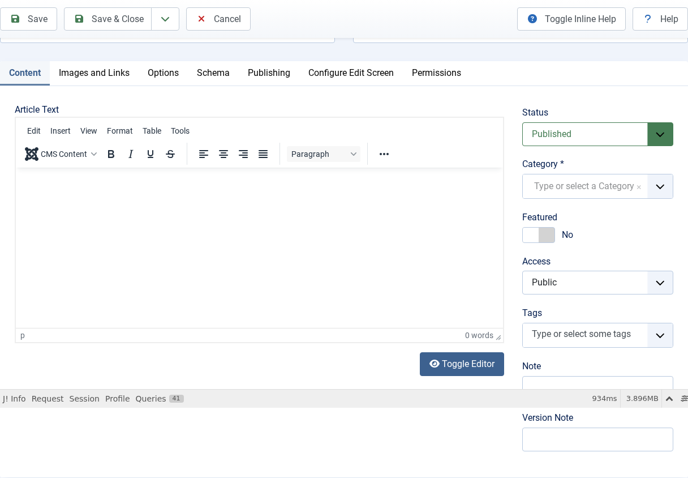
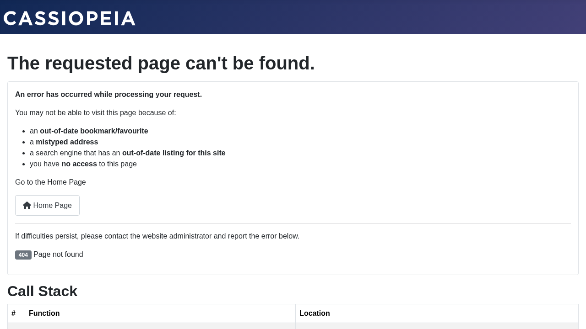

# Publishing Content to the Fediverse

---
[🏠 Tutorial Home](index.md) | [← Creating Actors](03-actors.md) | [Following and Followers →](05-follow.md)


Once you have a local actor set up and at least one remote follower, every article you publish by that actor is automatically wrapped in an ActivityPub `Create(Note)` activity and delivered to every follower's inbox. This tutorial walks through the full cycle: write an article, verify it appears in grace's outbox, and confirm that delivery was queued for remote recipients.

---

## Prerequisites

- Joomla Fediverse installed and both plugins enabled
- A local actor for the article's author (see [Tutorial 03 — Creating Actors](03-actors.md))
- At least one remote follower for that actor (optional for outbox verification; required for delivery testing — see [Tutorial 05 — Following & Followers](05-follow.md))

> **Important:** The **Content - Fediverse** plugin must be enabled. It is the hook that fires when a Joomla article is saved or published. Without it, nothing is queued for delivery.

---

## Step 1: Write and Publish the Article

In the Joomla administrator, navigate to **Content → Articles → New**. Fill in the article normally, then pay attention to one crucial field: **Author**.

In the **Publishing** tab (or the **Author** field in the right-hand sidebar), set the author to the Joomla user associated with your actor — in this tutorial that is **Grace**.


*Set the article author to the Joomla user linked to your Fediverse actor (grace). The Content plugin watches this field.*

Give the article a title and body, then set **Status** to *Published* and click **Save & Close**.

As soon as the article is saved in Published state, the Content - Fediverse plugin intercepts the save event, builds a `Create(Note)` activity, and inserts it into the delivery queue.

---

## Step 2: Check the Delivery Queue

Navigate to **Components → Fediverse → Deliveries** (or open the Fediverse Dashboard and click the delivery queue count). You should see one or more rows — one per follower inbox that grace has.


*Each row in the Deliveries view represents a pending HTTP POST to a remote inbox. The status column shows whether delivery has been attempted.*

The rows will remain in a *pending* state until the scheduler task runs. If you want to trigger delivery immediately, navigate to **System → Scheduled Tasks**, find **Fediverse — Deliver Outbound Activities**, and click **Run Now**.

---

## Step 3: Verify the Outbox

The outbox is a public, paginated ActivityPub collection of everything grace has published. Remote servers read it to catch up on missed activities. You can inspect it directly:

```
GET https://yoursite.example/activitypub/actors/grace/outbox
Accept: application/activity+json
```

The collection index response:

```json
{
  "@context": "https://www.w3.org/ns/activitystreams",
  "id": "https://yoursite.example/activitypub/actors/grace/outbox",
  "type": "OrderedCollection",
  "totalItems": 1,
  "first": "https://yoursite.example/activitypub/actors/grace/outbox?page=1"
}
```

Follow the `first` link to fetch the page of items:

```json
{
  "type": "OrderedCollectionPage",
  "orderedItems": [
    {
      "type": "Create",
      "object": {
        "type": "Note",
        "content": "<p>Hello, Fediverse!</p>"
      }
    }
  ]
}
```


*The outbox endpoint confirms that the article was wrapped in a Create activity and stored.*

---

## Editing and Deleting Articles

- **Editing** an article body creates an `Update(Note)` activity and queues it for delivery to all followers.
- **Deleting** (or unpublishing) an article creates a `Delete(Tombstone)` activity. Remote servers that cached the original post will remove it from their timelines when they process the Delete.

Both operations are automatic — the Content - Fediverse plugin handles them with no additional steps on your part.

---

## Common Issues

| Symptom | Likely cause | Solution |
|---|---|---|
| No delivery queue rows after publishing | Content - Fediverse plugin disabled | Enable `plg_content_fediverse` in **System → Plugins** |
| Delivery rows stuck in *pending* forever | Scheduler task not running | Configure a server cron or use **Run Now** as described above |
| Outbox returns an empty `orderedItems` | Article author is not a Fediverse actor | Create an actor for the author (Tutorial 03) |
| Remote timeline shows HTML instead of plain text | Note content is being double-encoded | Check for a third-party content plugin that transforms article output |
---
[🏠 Tutorial Home](index.md) | [← Creating Actors](03-actors.md) | [Following and Followers →](05-follow.md)
