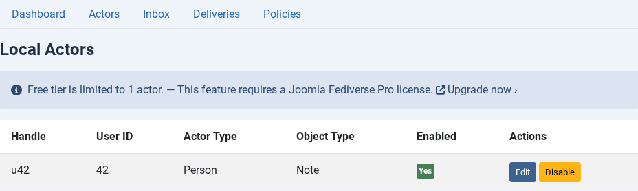

# Following & Followers

---
[🏠 Tutorial Home](index.md) | [← Publishing Content](04-publishing.md) | [Reactions Module →](06-reactions.md)


## How Fediverse Following Works

Following in ActivityPub is a three-step handshake. The remote user's server sends a `Follow` activity to the local actor's inbox. Joomla Fediverse receives it, checks the configured follow policy, and — if the policy permits — immediately responds with an `Accept` activity back to the remote actor's inbox. From that point on, the local actor's new posts are delivered to the remote follower's home timeline. Unfollowing works in reverse: the remote server sends an `Undo(Follow)` activity, and Joomla Fediverse removes the relationship from its followers table.

---

## Prerequisites

- Joomla Fediverse installed and both plugins enabled
- A local actor (see [Tutorial 03 — Creating Actors](03-actors.md))
- Follow policy set to `auto-accept` in Components → Fediverse → Options (default)

---

## Step 1: A Remote User Follows a Local Actor

When someone on another Fediverse server (say, `alice@peer.localhost`) searches for `grace@yoursite.example` and clicks **Follow**, their server sends a `Follow` activity to:

```
POST https://yoursite.example/activitypub/actors/grace/inbox
Content-Type: application/activity+json

{
  "@context": "https://www.w3.org/ns/activitystreams",
  "type": "Follow",
  "actor": "https://peer.localhost/users/alice",
  "object": "https://yoursite.example/activitypub/actors/grace"
}
```

Joomla Fediverse receives this in grace's inbox, verifies the HTTP Signature on the request, and — because the policy is `auto-accept` — immediately responds with:

```
POST https://peer.localhost/users/alice/inbox
{
  "type": "Accept",
  "object": { "type": "Follow", ... }
}
```

The follow relationship is now active. The next time grace publishes an article, it will be delivered to alice's inbox automatically.

---

## Step 2: View Followers in the Admin

Navigate to **Components → Fediverse → Actors**. The **Followers** column shows the number of confirmed remote followers for each actor.


*After alice follows grace, the Followers column increments to 1.*

You can click the follower count (or the actor row) to drill into the Followers sub-view, which lists each remote follower with their actor URI and the timestamp of the follow.

---

## Step 3: Triggering a Follow from the Peer (Testing)

In a test environment where you control both sides, you can instruct the Peer mock server to send a follow request programmatically. The acceptance tests in `tests/Acceptance/04_tutorial_follow.feature` automate this scenario end-to-end.

For manual testing, use the Peer's admin panel or its API to look up `grace@yoursite.example` and initiate a follow. The relationship state on the Peer side should transition from `pending` to `accepted` within a few seconds of the inbox worker processing the request (see Step 1).

---

## Step 4: Local Actor Following a Remote User (C2S)

Outbound follows — where a local actor follows someone on a remote server — require an OAuth 2.0 Client-to-Server (C2S) flow because they originate from a user action rather than a server-to-server push. This is covered in **§5.4 of the manual**. In short:

1. Obtain an OAuth access token scoped to `write:follows` for the local actor.
2. `POST` a `Follow` activity to grace's outbox:

   ```json
   {
     "type": "Follow",
     "object": "https://peer.localhost/users/alice"
   }
   ```

3. Joomla Fediverse signs the delivery and POSTs it to alice's inbox on the Peer.
4. If the Peer auto-accepts, grace's **Following** count increments.

---

## Step 5: Unfollow

Unfollowing is symmetric to following. The remote server sends an `Undo(Follow)` activity to grace's inbox:

```json
{
  "type": "Undo",
  "object": {
    "type": "Follow",
    "actor": "https://peer.localhost/users/alice",
    "object": "https://yoursite.example/activitypub/actors/grace"
  }
}
```

Joomla Fediverse removes alice from grace's followers table. The **Followers** count on the Actors list drops back to zero. Future articles published by grace will no longer be delivered to alice.

---

## Screenshots


*After the Peer sends a follow request, the Actors list updates to show the new follower count once the inbox worker processes the activity.*

---

## Common Issues

| Symptom | Likely cause | Solution |
|---|---|---|
| Follow request not accepted | Follow policy set to `manual` | Change the default follow policy to `auto-accept`, or manually approve the request via the Followers sub-view |
| Follower count not updating | Inbox worker task not running | Run **Fediverse — Inbox Worker** via **System → Scheduled Tasks → Run Now** |
| HTTP 401 on incoming follow | HTTP Signature verification failed | Ensure the remote actor's public key is reachable; check that server clocks are within 5 minutes of each other |
| Accept activity not delivered back to remote | Delivery task not running | Check the delivery queue and run the **Deliver Outbound Activities** task |
---
[🏠 Tutorial Home](index.md) | [← Publishing Content](04-publishing.md) | [Reactions Module →](06-reactions.md)
