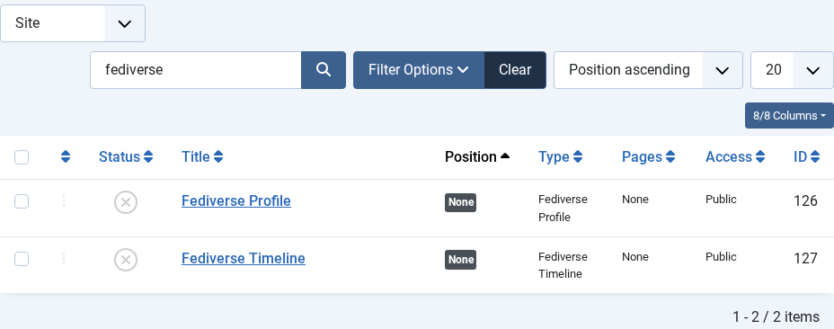
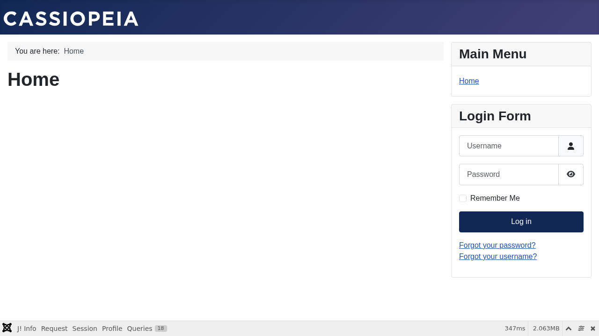

# Reactions Module

---
[🏠 Tutorial Home](index.md) | [← Following and Followers](05-follow.md) | [Domain Policies →](07-policies.md)


The **Reactions module** (`mod_fediverse_reactions`) displays live engagement counts — likes, boosts, and replies — directly on a Joomla article page. The counts are sourced from inbound ActivityPub activities stored in the Fediverse inbox and are updated every time the scheduler processes the queue.

---

## Prerequisites

- Joomla Fediverse installed and both plugins enabled (see [Tutorial 01 — Installation](01-installation.md))
- At least one local actor with published articles (see [Tutorial 04 — Publishing Content](04-publishing.md))
- The Fediverse scheduled tasks enabled and running (see [Tutorial 09 — Scheduled Tasks](09-tasks.md))

---

## Step 1: What the Reactions Module Shows

Each article that has been federated by Joomla Fediverse can accumulate three types of reactions from the wider Fediverse:

| Reaction | ActivityPub type | What it means |
|----------|-----------------|---------------|
| ❤ Likes   | `Like`          | A remote user favourited the article note |
| 🔁 Boosts  | `Announce`      | A remote user boosted (reshared) the article note |
| 💬 Replies | `Create(Note)`  | A remote user replied to the article note |

The module queries the local `#__fediverse_inbox` table for activities whose `object` URI matches the article's ActivityPub object URI, then renders the totals in a configurable template.

---

## Step 2: Install and Configure the Module

1. In the Joomla administrator, navigate to **Extensions → Modules → New**.
2. In the module type selector, search for **Fediverse** and choose **Fediverse Reactions**.
3. Fill in the module title (e.g. *Reactions*).
4. Under **Module** tab, configure the display options:
   - **Show Likes**: Yes / No
   - **Show Boosts**: Yes / No
   - **Show Replies**: Yes / No
   - **Icon style**: text labels or emoji icons
5. Under **Menu Assignment**, choose **Only on the pages selected** and pick the article menu items (or use **On all pages** for a global placement).


*The Reactions module configuration form. Enable the counts you want to display and set the position.*

---

## Step 3: Assign the Module to a Position

Set the **Position** field to the template position that appears on single-article views. In the default Cassiopeia template, `position-7` is rendered below the article body. You can also use `after-article` if your template defines that position.

After saving, the module will appear on every article page included in the menu assignment. If no reactions have been received yet, it renders empty (or hidden, depending on the **Hide when empty** option).

---

## Step 4: Generating Reactions for Testing

To see live data, a remote Fediverse account must interact with one of grace's articles:

1. Ensure `alice@peer.localhost` follows `grace@yoursite.example` (see [Tutorial 05](05-follow.md)).
2. From the Peer, navigate to alice's timeline and open the boosted article note.
3. Click **Favourite** (Like) or **Boost** (Announce).
4. Wait for the scheduler to process the incoming activity (or trigger it manually from **System → Scheduled Tasks → Run Now**).

Once the inbox worker has processed the `Like` or `Announce` activity, the reaction count increments.

---

## Step 5: Verify on the Front End

Navigate to the article on your site's front end. The Reactions module should now appear at the assigned position and display the updated counts.


*After alice likes the article on the Peer, the Reactions module shows 1 like on the front-end article page.*

---

## Step 6: Like and Boost Buttons

The Reactions module can display optional **Like** and **Boost** action buttons alongside the reaction counts. These buttons let site visitors interact with content from their own Fediverse account without leaving your site.

### Enabling the Buttons

In the module configuration (**Extensions → Modules → [your Reactions module]**), the **Module** tab has two new options:

| Option | Default | Description |
|--------|---------|-------------|
| **Show Like Button** | Yes | Displays a ❤ Like button below the reaction counts |
| **Show Boost Button** | Yes | Displays a 🔁 Boost button below the reaction counts |

### How Visitors Use the Buttons

When a visitor clicks **Like** or **Boost**, a small prompt appears asking them to enter their Fediverse handle (e.g. `@you@mastodon.social`). The site remembers the handle in the browser for future interactions. Once confirmed, the visitor is redirected to their home server, which opens the article in context and lets them complete the like or boost directly from their own account.

> **Why a redirect instead of acting directly?** The Fediverse is a network of independent servers. Each server manages its own authentication and signing. Redirecting to the visitor's home server is the standard, privacy-preserving approach — it works with every ActivityPub server (Mastodon, GotoSocial, Friendica, Hubzilla, etc.) without requiring your site to handle third-party credentials.

### Disabling the Buttons

Set **Show Like Button** and **Show Boost Button** to **No** in the module configuration if you prefer a read-only reactions display.

---

## Step 7: Inline Reaction Counts via Shortcode

In addition to the module, you can render the same live counts **inline anywhere in article content** using the `{{fediverse:reactions}}` shortcode:

```
This post has {{fediverse:reactions}} so far.
```

On the front end this is replaced with the same counts the module shows (e.g. `❤ 3 · 🔁 1 · 💬 2`). The shortcode requires the **Content - Fediverse Tags** plugin to be enabled — see [Tutorial 10 — Shortcodes](10-shortcodes.md) for full details.

---

## Common Issues

| Symptom | Likely cause | Fix |
|---------|-------------|-----|
| Module not showing | Not assigned to the correct position or menu item | Check Module → Menu Assignment and Position settings |
| Counts always zero | Scheduler not running or inbound activities not processed | Enable scheduled tasks (see [Tutorial 09](09-tasks.md)) and run them manually to verify |
| Module shows but counts don't update | Content - Fediverse plugin disabled | Enable the plugin at **Extensions → Plugins → Content - Fediverse** |
| Counts appear on wrong articles | Multiple actors share the same article | Verify the article author is set to a single federated actor |
| Buttons appear but Copy button does nothing | Browser does not support the Clipboard API (HTTP or very old browser) | Ensure the site is served over HTTPS; the Clipboard API requires a secure context |
---
[🏠 Tutorial Home](index.md) | [← Following and Followers](05-follow.md) | [Domain Policies →](07-policies.md)
