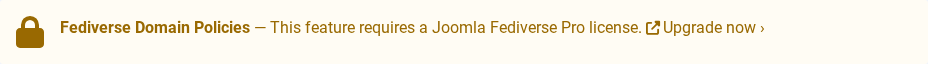
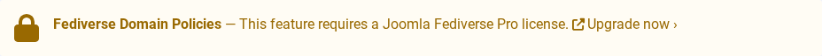

# Domain Policies

---
[🏠 Tutorial Home](index.md) | [← Reactions Module](06-reactions.md) | [Admin UI Tour →](08-admin-ui.md)

Domain policies let site administrators control which remote domains are permitted to federate with local actors. A policy can allow or block an entire domain, and individual actors or articles can opt out of federation entirely.

---

## Prerequisites

- Joomla Fediverse installed and configured (see [Tutorial 01](01-installation.md) and [Tutorial 02](02-configuration.md))
- At least one local actor enabled (see [Tutorial 03](03-actors.md))
- Administrator access to **Components → Fediverse → Policies**

---

## Step 1: What Domain Policies Do

Joomla Fediverse evaluates incoming and outgoing federation requests against an ordered list of rules:

| Rule type | Effect |
|-----------|--------|
| **Block domain** | Refuses all inbound and outbound activities for that domain. Follow requests from blocked domains are automatically rejected. |
| **Allow domain** | Explicitly permits federation with a domain (useful when the global default is set to *deny all*). |
| **Per-actor opt-out** | Removes an actor's content from federation entirely — no activities are queued and no follows are accepted. |
| **Per-content opt-out** | Marks a single article as non-federated — the article is not wrapped in a `Create(Note)` and never queued for delivery. |

Policies are evaluated in order. The first matching rule wins.

---

## Step 2: Opening the Policies View

Navigate to **Components → Fediverse → Policies**. On a fresh installation the list is empty.

*An empty Policies list. No domain restrictions are active yet.*

---

## Step 3: Adding a Block Policy for `bad-actor.example`

1. Click **New** in the toolbar.
2. In the **Domain** field, enter `bad-actor.example`.
3. Set **Policy** to **Block**.
4. Leave **Actor** blank to apply the rule site-wide.
5. Click **Save & Close**.

*The Add Policy form. Enter the domain and set the policy type to Block.*

The domain is now blocked. Any follow request from `bad-actor.example` will be rejected with an `Reject` activity. Outbound activities destined for `bad-actor.example` are dropped from the delivery queue.

*The Policies list after adding the block rule for bad-actor.example.*

---

## Step 4: Per-User Opt-Out for bob

To disable federation for a specific local actor (for example, `bob` does not want his articles to appear on the Fediverse):

1. In **Components → Fediverse → Policies**, click **New**.
2. Leave **Domain** blank.
3. Set **Policy** to **Block**.
4. In the **Actor** field, select `bob`.
5. Click **Save & Close**.

From this point, bob's articles are never queued for delivery and his actor profile will not accept new follow requests.

---

## Step 5: Per-Content Opt-Out

To exclude a single article from federation:

1. Open the article in the Joomla content editor (**Content → Articles**).
2. Navigate to the **Options** or **Fediverse** tab.
3. Set **Federate this article** to **No**.
4. Save the article.

The Content - Fediverse plugin checks this flag before queuing the activity. Articles marked as non-federated are silently skipped.

---

## Step 6: Follow Policy Setting

The global follow policy determines whether remote follow requests are automatically accepted or require manual approval:

1. Navigate to **Components → Fediverse → Options** (or click **Options** in the toolbar from any Fediverse admin view).
2. In the **Follow Policy** field, choose:
   - **Auto-accept** — Follow requests are accepted immediately (default).
   - **Manual approval** — Follow requests are queued for administrator review.
3. Click **Save**.

Per-actor overrides can be set with the `Joomla policy allows/denies follows for actor` Behat steps in acceptance tests.

---

## Common Issues

| Symptom | Likely cause | Fix |
|---------|-------------|-----|
| Block not working immediately | Delivery cache or in-flight scheduler run | Wait for the next scheduler cycle or run tasks manually |
| Per-user opt-out not respected | Content - Fediverse plugin disabled | Enable the plugin at **Extensions → Plugins → Content - Fediverse** |
| Manual approval queue not visible | No pending follows | Send a test follow from the Peer mock server |
---
[🏠 Tutorial Home](index.md) | [← Reactions Module](06-reactions.md) | [Admin UI Tour →](08-admin-ui.md)
