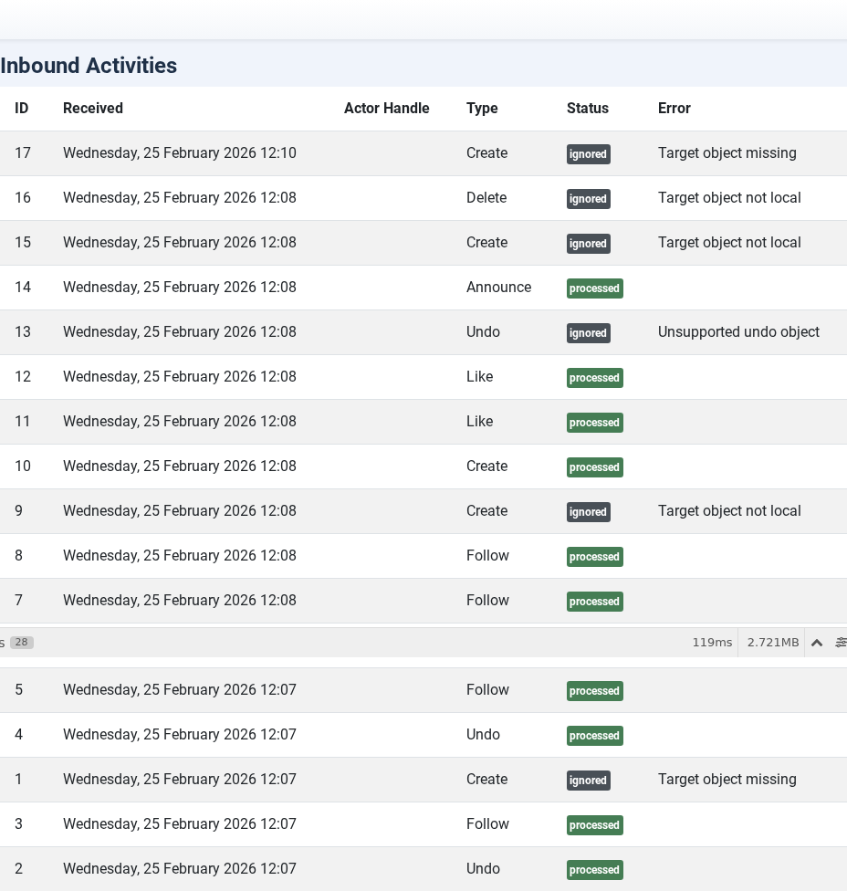
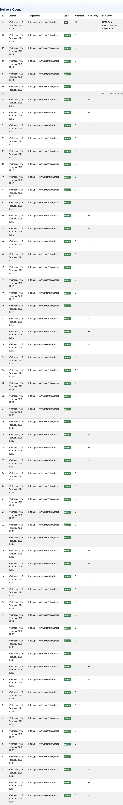

# Admin UI Tour

---
[🏠 Tutorial Home](index.md) | [← Domain Policies](07-policies.md) | [Scheduled Tasks →](09-tasks.md)

Joomla Fediverse adds five views under **Components → Fediverse** in the Joomla administrator. This tutorial is a guided tour of each view, explaining the data they present and the actions available.

---

## Prerequisites

- Joomla Fediverse installed (see [Tutorial 01](01-installation.md))
- Logged in as a Joomla Administrator (Super User or Administrator group)

---

## 1. Dashboard

Navigate to **Components → Fediverse** (the default view is the Dashboard).

*The Fediverse Dashboard shows at-a-glance counts for all key entities.*

The Dashboard displays summary cards:

| Card | What it counts |
|------|---------------|
| **Actors** | Total local Fediverse actors registered on this site |
| **Followers** | Total confirmed remote followers across all actors |
| **Inbox** | Total inbound activities received (all time) |
| **Pending deliveries** | Outbound activities waiting to be delivered |
| **Failed deliveries** | Deliveries that exhausted all retry attempts |

Click any card to jump directly to the corresponding list view.

---

## 2. Actors

Navigate to **Components → Fediverse → Actors**.

*The Actors list shows all local actors and their federation status.*

Column reference:

| Column | Meaning |
|--------|---------|
| **Handle** | The actor's Fediverse handle, e.g. `grace@yoursite.example` |
| **Joomla User** | The linked Joomla user account |
| **Status** | Enabled (green tick) or Disabled (red cross) |
| **Followers** | Number of confirmed remote followers |
| **Published** | Number of federated articles |

Click **Enable** or **Disable** in the Status column to toggle federation for an actor without deleting the actor record. Disabling an actor stops new deliveries and rejects new follow requests, but preserves the existing follower list.

---

## 3. Inbox

Navigate to **Components → Fediverse → Inbox** (or `?option=com_fediverse&view=inboxitems`).

*The Inbox lists every inbound ActivityPub activity received by any local actor.*

Column reference:

| Column | Meaning |
|--------|---------|
| **Activity ID** | The `id` URI from the incoming activity JSON |
| **Type** | Activity type: `Follow`, `Undo`, `Create`, `Like`, `Announce`, `Delete`, etc. |
| **Actor (remote)** | The remote actor that sent the activity |
| **Target (local)** | The local actor whose inbox received it |
| **Received** | UTC timestamp of receipt |
| **Status** | `processed`, `pending`, `error` |

Use the **Status** filter to isolate activities stuck in `error` state for investigation.

---

## 4. Deliveries

Navigate to **Components → Fediverse → Deliveries**.

*The Deliveries view shows the outbound activity queue.*

Column reference:

| Column | Meaning |
|--------|---------|
| **Activity** | Summary of the wrapped activity (`Create`, `Update`, `Delete`, `Follow`, `Accept`, etc.) |
| **From** | Local actor sending the activity |
| **To** | Remote inbox URI |
| **Status** | `pending`, `delivered`, `failed`, `retrying` |
| **Attempts** | Number of delivery attempts made |
| **Next attempt** | Scheduled time for the next retry (exponential back-off) |

Click a row to view the full activity JSON and the error message from the last failed attempt. Failed deliveries that have exhausted all retries remain in the list for audit purposes; delete them manually when they are no longer needed.

---

## 5. Policies

Navigate to **Components → Fediverse → Policies**.

*The Policies list shows domain-level and actor-level federation rules.*

For a full explanation of how to create and manage policies, see [Tutorial 07 — Domain Policies](07-policies.md).

---

## Common Issues

| Symptom | Likely cause | Fix |
|---------|-------------|-----|
| All views show no data | Extension was just installed with no activity yet | Publish an article or send a test follow from the Peer |
| Permission error accessing Fediverse views | Logged-in user is not in the Administrator group | Add the user to the Administrator group in **Users → Groups** |
| Dashboard counts don't match list view counts | Browser cache | Hard-refresh (Ctrl+Shift+R) or clear the Joomla cache at **System → Clear Cache** |
---
[🏠 Tutorial Home](index.md) | [← Domain Policies](07-policies.md) | [Scheduled Tasks →](09-tasks.md)
