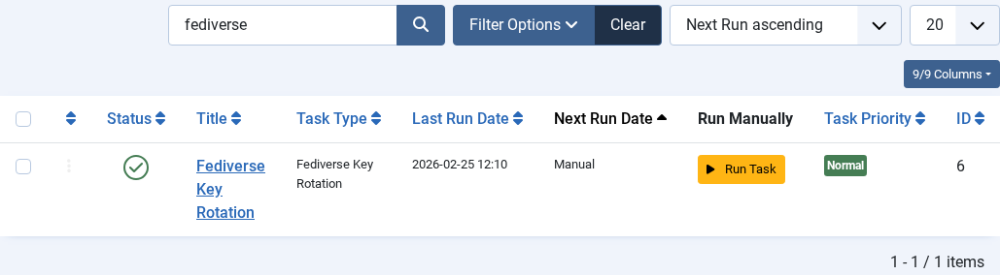
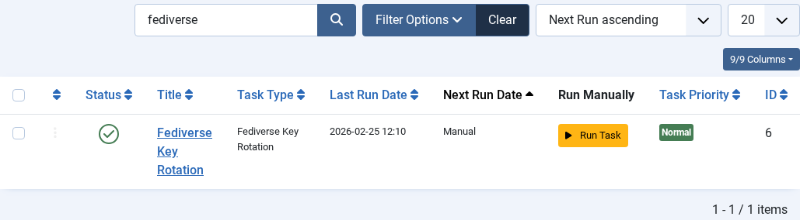

# Scheduled Tasks

---
[🏠 Tutorial Home](index.md) | [← Admin UI Tour](08-admin-ui.md) | [Fediverse Shortcodes →](10-shortcodes.md)


Joomla Fediverse relies on Joomla's Scheduled Tasks framework (introduced in Joomla 4.1) to run background work. Without scheduled tasks, activities pile up in the delivery queue and inbound inbox records are never cleaned up. This tutorial explains which tasks are registered, how to configure their run intervals, and how to monitor their execution.

---

## Prerequisites

- Joomla Fediverse installed (see [Tutorial 01](01-installation.md))
- Joomla 4.1+ with the Scheduled Tasks component enabled
- Administrator access to **System → Scheduled Tasks**
- A server-level cron job hitting `cli/joomla.php task:run --all` (or the equivalent Joomla task runner URL) on a regular interval

---

## Step 1: Tasks Registered by Joomla Fediverse

Joomla Fediverse registers two task plugins:

| Task name | Plugin | What it does |
|-----------|--------|-------------|
| **Fediverse — Deliver Outbound Activities** | `plg_task_fediverse_delivery` | Processes the delivery queue — takes `pending` rows from `#__fediverse_deliveries`, POSTs them to remote inboxes, and updates the status to `delivered` or schedules a retry on failure. |
| **Fediverse — Clean Up Old Records** | `plg_task_fediverse_cleanup` | Removes `processed` inbox records and successfully `delivered` outbox entries older than a configurable retention period, keeping the database lean. |

---

## Step 2: Viewing Tasks in the Admin

Navigate to **System → Scheduled Tasks**. Use the search bar to filter for **fediverse**.


*Both Fediverse scheduled tasks are visible in the Scheduler list. The State column shows whether each task is enabled.*

Each row shows:

| Column | Meaning |
|--------|---------|
| **Title** | Human-readable task name |
| **Type** | Plugin type identifier |
| **Last run** | UTC timestamp of the most recent execution |
| **Next run** | Calculated next execution time based on the configured interval |
| **State** | Enabled / Disabled |
| **Exit code** | Result of the last run: `0` = success, non-zero = error |

---

## Step 3: Configuring Task Intervals

1. Click the task title (e.g. **Fediverse — Deliver Outbound Activities**) to open the task form.
2. In the **Execution rules** section, set the **Test rule** (interval):
   - For the delivery task, `Every 1 minute` is recommended for responsive federation.
   - For the cleanup task, `Every 1 day` is sufficient.
3. Click **Save & Close**.


*The task detail form showing the execution interval configuration.*

---

## Step 4: Triggering Tasks Manually

During development or when diagnosing issues, you can run a task on demand without waiting for the scheduler interval:

1. Navigate to **System → Scheduled Tasks**.
2. Check the checkbox next to the task you want to run.
3. Click **Run** in the toolbar (or use the **Run Now** inline action button if present).

Alternatively, run the task from the command line:

```bash
php cli/joomla.php scheduler:run --id=<task_id>
```

Replace `<task_id>` with the numeric ID shown in the task list URL.

---

## Step 5: Monitoring Task Execution in the Action Log

Joomla's Action Log records each task execution. Navigate to **System → Action Logs** and filter by **Extension** = `com_scheduler` to see a timestamped history of every task run, including exit codes and any error messages written by the task plugin.

If the delivery task fails repeatedly, the Action Log entry will contain the HTTP error code returned by the remote inbox endpoint — useful for diagnosing connectivity issues with specific Fediverse instances.

---

## Common Issues

| Symptom | Likely cause | Fix |
|---------|-------------|-----|
| Tasks never run | No server cron job configured | Add a cron entry: `* * * * * php /path/to/cli/joomla.php scheduler:run --all` |
| Tasks show as enabled but exit code is non-zero | Database permission error or plugin error | Check the Action Log for the specific error message and verify `#__fediverse_deliveries` table permissions |
| Delivery task runs but nothing is delivered | Remote Peer unreachable from the Joomla server | Test connectivity: `curl -I https://peer.localhost/` from the Joomla server and check firewall rules |
| Cleanup task removes too many records | Retention period too short | Increase the retention period in the cleanup task configuration form |
---
[🏠 Tutorial Home](index.md) | [← Admin UI Tour](08-admin-ui.md) | [Fediverse Shortcodes →](10-shortcodes.md)
